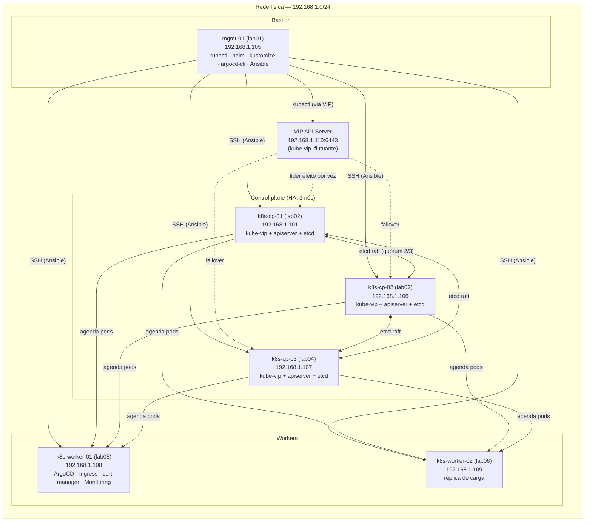
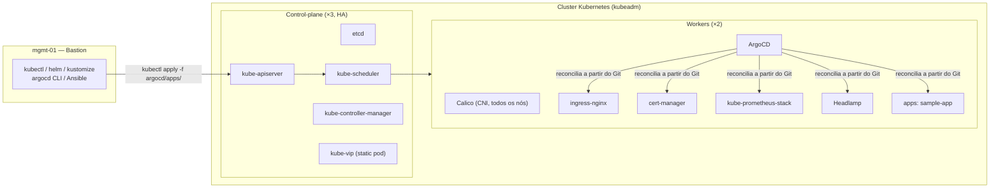
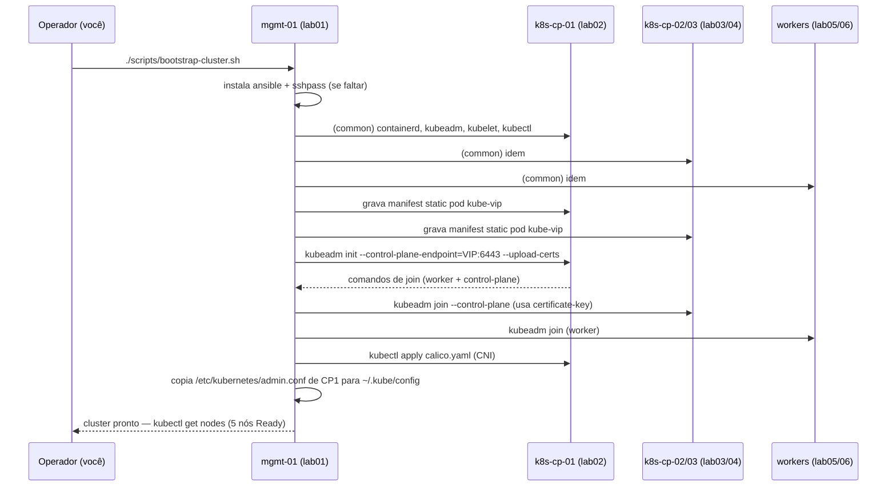

# Ambiente Real e Implementação — Plataforma GitOps Kubernetes

> Este documento descreve o **ambiente físico real** (6 VMs no Hyper-V), como ele mapeia
> para a arquitetura descrita em [`ARQUITETURA.md`](./ARQUITETURA.md), e o passo a passo
> de bootstrap do cluster Kubernetes via `kubeadm` + `kube-vip` + `Calico`, substituindo o
> fluxo baseado em `kind`/WSL2 descrito originalmente no [`GUIA-DE-IMPLEMENTACAO.md`](./GUIA-DE-IMPLEMENTACAO.md)
> (Fases 0-2). Para a especificação completa do que será construído por cima do cluster
> (ArgoCD, observabilidade, etc.), veja [`../PROMPT.md`](../PROMPT.md).
>
> Diagramas neste documento usam **Mermaid** (texto versionado em Git, renderizado
> automaticamente no PDF gerado por `claude/docs/pdf/build_html.py`) — funciona como o
> Draw.io, mas como código: cada mudança de arquitetura é um diff legível, não um arquivo
> binário.

---

## 1. Visão Geral — do PROMPT.md ao Hardware Real

Recapitulando o objetivo (detalhado em [`../PROMPT.md`](../PROMPT.md)): construir uma
**plataforma GitOps de referência**, com `base/` + `overlays/{dev,prod}` orquestrados por
ArgoCD, observabilidade como código, e segurança desde o dia 1.

A decisão original do projeto era rodar o ambiente `dev` via `kind` (Kubernetes-in-Docker)
dentro do WSL2. Essa decisão **mudou**: o ambiente `dev` agora é um **cluster Kubernetes real**,
provisionado com `kubeadm` em **6 máquinas virtuais Ubuntu Server no Hyper-V**, com
**control-plane em alta disponibilidade (3 nós)** — um cenário muito mais próximo de produção
do que um cluster `kind` efêmero.

| | Antes (descontinuado) | Agora |
|---|---|---|
| Onde roda | WSL2 (Ubuntu-24.04) dentro do Windows Server | 6 VMs Ubuntu Server dedicadas no Hyper-V |
| Como sobe o cluster | `kind create cluster` (nós = containers Docker) | `kubeadm init`/`join` (nós = VMs reais) |
| Control-plane | 1 nó (dentro do `kind-config.yaml`) | 3 nós em HA, com VIP via `kube-vip` |
| CNI | `kindnet` (padrão do kind) | `Calico` (enforcement real de NetworkPolicy) |
| Rede | NAT interno do Docker/WSL2 | Rede física da LAN (`192.168.1.0/24`) |

---

## 2. Inventário Real das Máquinas

| Papel | Hostname físico | IP | Usuário | vCPU¹ | RAM¹ | Função |
|---|---|---|---|---|---|---|
| Bastion / gerenciamento | `lab01` | `192.168.1.105` | `lab01` | 2 | 4 GB | Roda `kubectl`, `helm`, `kustomize`, `argocd` CLI e o Ansible que provisiona todo o resto. Não participa do cluster Kubernetes. |
| Control-plane #1 | `lab02` | `192.168.1.101` | `lab02` | 2-4 | 8 GB | Primeiro nó (`kubeadm init`), também roda `kube-vip`. |
| Control-plane #2 | `lab03` | `192.168.1.106` | `lab03` | 2-4 | 8 GB | Entra via `kubeadm join --control-plane`, também roda `kube-vip`. |
| Control-plane #3 | `lab04` | `192.168.1.107` | `lab04` | 2-4 | 8 GB | Idem — fecha o quórum de 3 nós do `etcd`, também roda `kube-vip`. |
| Worker #1 | `lab05` | `192.168.1.108` | `lab05` | 4 | 16 GB | Roda as cargas: ArgoCD, ingress-nginx, cert-manager, kube-prometheus-stack. |
| Worker #2 | `lab06` | `192.168.1.109` | `lab06` | 4 | 16 GB | Idem — distribui carga com o worker #1. |

¹ vCPU/RAM conforme planejado em [`handoff.md`](../../handoff.md); ajustar conforme alocado de fato no Hyper-V.

**IP virtual (VIP) do control-plane:** `192.168.1.110:6443`, gerenciado por `kube-vip` (não é
uma 7ª VM — é um endereço flutuante anunciado por ARP por quem quer que seja o líder entre os
3 control-planes naquele momento). **Confirme que esse IP está livre e fora do range do DHCP**
da rede `192.168.1.0/24` antes de rodar o bootstrap.

> ⚠️ As senhas reais de acesso SSH (mesma para todas as VMs no momento da criação) estão em
> `scripts/inventory.ini`, que é **ignorado pelo Git** (`.gitignore` na raiz) — nunca commitar
> esse arquivo. Troque essas senhas (ou migre para autenticação por chave) depois do bootstrap
> inicial; ver seção 7.

---

## 3. Diagrama de Rede



---

## 4. Diagrama de Componentes (o que roda em cada nó)



---

## 5. Sequência de Bootstrap (o que o script automatiza)



Após esse ponto, o cluster Kubernetes existe e está saudável — mas **vazio** (sem ArgoCD,
sem Ingress, sem nada além do CNI). A partir daqui, segue-se o restante do
[`GUIA-DE-IMPLEMENTACAO.md`](./GUIA-DE-IMPLEMENTACAO.md) a partir da **Fase 3** (bootstrap do
ArgoCD), já que as Fases 0-2 (ferramentas, esqueleto, subir cluster) foram substituídas pelo
fluxo deste documento.

---

## 6. Como Executar

### 6.1 Pré-requisitos

- As 6 VMs criadas, com Ubuntu Server instalado, acessíveis por SSH com usuário/senha.
- Acesso de rede entre `mgmt-01` e as outras 5 VMs (mesma sub-rede `192.168.1.0/24`).
- O IP `192.168.1.110` (VIP) livre e fora da faixa do DHCP.
- Este repositório clonado **dentro da VM `mgmt-01`** (não no Windows/host Hyper-V) — é de lá
  que o Ansible vai orquestrar as outras 5 VMs via SSH.

```bash
# dentro da VM mgmt-01 (lab01)
git clone <url-deste-repo>
cd GitOps-LAB-Kubernetes-Observabilidade/scripts
cp inventory.example.ini inventory.ini
nano inventory.ini   # preencher IPs/usuários/senhas reais (já vêm preenchidos como exemplo)
```

### 6.2 Rodar o bootstrap

```bash
./bootstrap-cluster.sh
```

O script:
1. Instala `ansible` e `sshpass` em `mgmt-01` se não existirem.
2. Testa conectividade SSH com as 5 outras VMs (`ansible all -m ping`).
3. Executa `playbooks/site.yml`, que aplica os passos da seção 5 em ordem, **de forma
   idempotente** (pode ser executado de novo sem quebrar nada — cada tarefa verifica o
   estado atual antes de agir).

### 6.3 Validar

```bash
# ainda em mgmt-01
kubectl get nodes -o wide   # esperar 5 nós Ready (3 control-plane + 2 workers)
kubectl get pods -n kube-system   # calico-node, kube-vip, coredns, etc. Running
```

**Critério de saída:** `kubectl get nodes` mostra os 5 nós do cluster em `Ready`, e
`kubectl get pods -A` não mostra nenhum pod em `CrashLoopBackOff`/`Pending` por falta de CNI.

---

## 7. Observações de Segurança (ambiente de laboratório)

- As senhas usadas no inventário (a mesma senha simples em todas as VMs) são **adequadas apenas para
  o bootstrap inicial em rede isolada de laboratório**. Antes de expor este ambiente a
  qualquer rede menos confiável, ou ao seguir para hardening (Fase 8 do guia), troque as
  senhas e migre para autenticação por chave SSH (`ssh-copy-id`).
- `scripts/inventory.ini` contém credenciais reais e está no `.gitignore` — confirme que
  nunca foi commitado (`git log --all -- scripts/inventory.ini` deve retornar vazio).
- O bootstrap usa `ansible_become_password` (sudo) igual à senha de login — também trocar
  junto quando rotacionar credenciais.

---

## 8. Onde Isto se Encaixa no Resto do Projeto

| Pergunta | Onde procurar |
|---|---|
| "Por que kubeadm e não kind/k3s?" | [`handoff.md`](../../handoff.md), seção 7 — decisão registrada com o histórico da conversa |
| "O que vem depois do cluster estar de pé?" | [`GUIA-DE-IMPLEMENTACAO.md`](./GUIA-DE-IMPLEMENTACAO.md), a partir da Fase 3 |
| "Por que a arquitetura é dividida em base/overlays?" | [`ARQUITETURA.md`](./ARQUITETURA.md) |
| "Qual o contrato completo de cada componente (ArgoCD, observabilidade, etc.)?" | [`../PROMPT.md`](../PROMPT.md) |
| "Como rodar o provisionamento das VMs?" | Este documento, seção 6, e `scripts/` |
