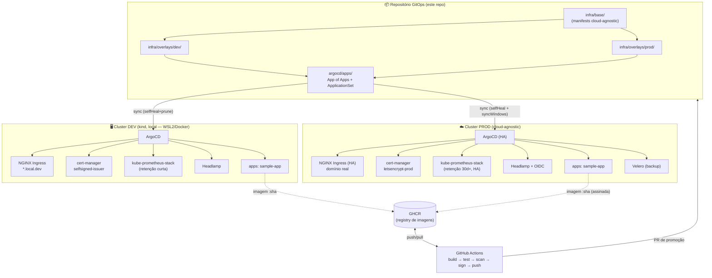
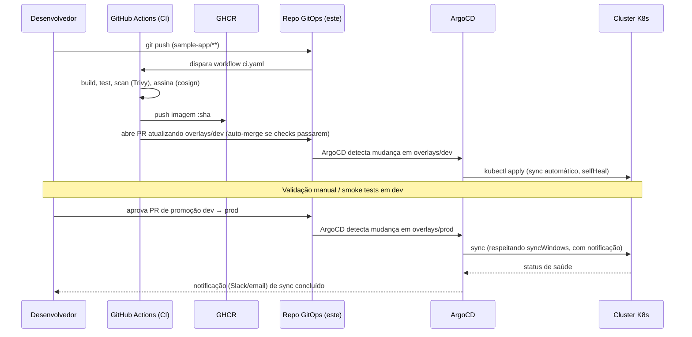

# Arquitetura — Plataforma GitOps Kubernetes (Dev + Produção)

> Este documento explica **o que** estamos construindo, **por que** as decisões foram tomadas
> dessa forma, e **como** as peças se encaixam. Para o passo a passo de implementação, veja
> [`GUIA-DE-IMPLEMENTACAO.md`](./GUIA-DE-IMPLEMENTACAO.md). Para a especificação que orienta
> a construção, veja [`../PROMPT.md`](../PROMPT.md).

---

## 1. Visão Geral

Estamos construindo um **laboratório GitOps que espelha um ambiente de produção real**, não
um "demo descartável". A ideia central:

> Um único repositório descreve o estado desejado de **N ambientes**. A diferença entre
> "rodar no meu notebook" e "rodar em produção" deve ser um **diff pequeno e legível** entre
> `overlays/dev/` e `overlays/prod/` — nunca um conjunto de manifestos paralelos e divergentes.

Isso é alcançado combinando três padrões consolidados da comunidade Kubernetes:

| Padrão | Papel aqui |
|---|---|
| **Kustomize `base/` + `overlays/`** | Elimina duplicação: a base descreve "o quê", o overlay descreve "como, neste ambiente" |
| **GitOps com ArgoCD (App of Apps / ApplicationSet)** | O cluster nunca é alterado por `kubectl apply` manual — apenas reconcilia o que está no Git |
| **Pipeline CI/CD com promoção via PR** | Imagens são construídas uma vez, escaneadas, assinadas, e promovidas entre ambientes por revisão humana, não por script silencioso |

---

## 2. Diagrama de Arquitetura (visão de componentes)

---

## 3. Fluxo de mudança (do código ao cluster)

A diferença crucial em relação a um pipeline ingênuo: **nada aplica diretamente no cluster**.
O CI só constrói, testa, escaneia e abre PRs. Quem aplica é o ArgoCD, reconciliando o que
está em `main`. Isso dá auditoria completa (todo `kubectl apply` tem um commit e um PR por trás).

---

## 4. Por que Kustomize `base/` + `overlays/` (e não Helm puro, nem repos separados)?

Avaliamos três abordagens (ver também a pergunta que orientou esta decisão):

1. **Kustomize base + overlays** *(escolhida)* — a base contém o que é comum (recursos,
   labels, estrutura), e cada overlay aplica *patches* (`patchesStrategicMerge`,
   `images`, `replicas`, `configMapGenerator`) só com o que muda. Funciona nativamente com
   ArgoCD (`kustomize build` é suportado out-of-the-box) e com Helm charts via
   `helmCharts:` no `kustomization.yaml`, então não perdemos a riqueza dos charts da
   comunidade (kube-prometheus-stack, ingress-nginx, argo-cd).
2. Helm `values-dev.yaml` / `values-prod.yaml` — mais simples à primeira vista, mas tende a
   duplicar blocos inteiros de YAML entre arquivos de values, e não generaliza bem para
   manifests que não vêm de chart (ex.: `Application` do ArgoCD, `NetworkPolicy`, `PrometheusRule`).
3. Repos/branches separados por ambiente — isola bem, mas qualquer correção de bug precisa
   ser replicada manualmente em N lugares; é o oposto de "single source of truth".

A combinação **Kustomize por cima + Helm chart como fonte (via `helmCharts:`) por baixo**
nos dá o melhor dos dois mundos: usamos os charts oficiais e bem mantidos da comunidade,
e customizamos por ambiente de forma declarativa e sem duplicação.

---

## 5. Por que cloud-agnostic em produção?

Este laboratório roda hoje em **WSL2 num Windows Server**, mas o objetivo de "produção" é
servir como modelo adaptável a **qualquer cluster real** — gerenciado (EKS/GKE/AKS) ou
on-prem/bare-metal (k3s, kubeadm). Hard-codar para um provider específico (ex.: AWS ALB
Ingress Controller + Route53 + ACM) tornaria o repositório inútil fora daquele contexto.

Em vez disso:

- **Ingress**: usamos a API padrão `Ingress` + NGINX Ingress Controller — funciona em
  qualquer cluster. Quem estiver na AWS pode trocar por ALB depois sem reescrever a aplicação.
- **LoadBalancer**: em clusters gerenciados, o `Service type: LoadBalancer` provisiona o LB
  da nuvem automaticamente; on-prem, documentamos **MetalLB** como peça plugável.
- **DNS**: `external-dns` suporta dezenas de providers via configuração — não escrevemos
  código específico de nenhum.
- **TLS**: `cert-manager` com `ClusterIssuer` Let's Encrypt — `HTTP01` funciona em qualquer
  lugar com Ingress público; `DNS01` é documentado como opção plugável por provider de DNS.

Cada decisão "agnostic" no [`PROMPT.md`](../PROMPT.md) vem acompanhada de uma nota de
"como adaptar para um provider específico" — então quem for de fato colocar isso na AWS,
por exemplo, sabe exatamente os 3-4 pontos de extensão a trocar.

---

## 6. Diferenças DEV vs PROD (o "diff" que importa)

Esta tabela **é** a especificação dos overlays — cada linha vira um patch Kustomize.

| Aspecto | `overlays/dev/` | `overlays/prod/` |
|---|---|---|
| Domínio | `*.local.dev` (DNS local / `/etc/hosts`) | domínio real via `external-dns` |
| TLS | `cert-manager` self-signed | `cert-manager` + Let's Encrypt (`letsencrypt-prod`) |
| Réplicas (Ingress, ArgoCD, Grafana...) | 1 | ≥ 2 + `PodDisruptionBudget` |
| Armazenamento (Prometheus, ArgoCD Redis) | StorageClass local / `emptyDir`, retenção curta (7d) | StorageClass dinâmica, retenção 30d+, Redis HA |
| Pod Security Standard | `baseline` | `restricted` |
| `ArgoCD.server.insecure` | `true` (TLS termina no Ingress local) | `false` (TLS ponta a ponta) |
| Autenticação (Headlamp/Grafana/ArgoCD) | local / token de ServiceAccount | OIDC / SSO corporativo |
| `syncPolicy` ArgoCD | `automated.{prune,selfHeal}` sem restrição | `automated.selfHeal` + `syncWindows` (evita sync em horário de pico) + Notifications |
| Alertmanager | desabilitado ou rota local | roteamento real (Slack/email/PagerDuty) |
| Backup (Velero) | opcional/desabilitado | obrigatório, com agendamento e teste de restore |
| Recursos (`requests`/`limits`) | mínimos (laptop-friendly) | dimensionados para carga real, com HPA onde fizer sentido |
| Network egress para registry/Let's Encrypt | livre (lab) | revisado/whitelisted conforme política da organização |

---

## 7. Decisões de segurança e o porquê

| Decisão | Motivação |
|---|---|
| `restricted` Pod Security Standard em prod | Bloqueia contêineres rodando como root, com filesystem gravável, ou com escalonamento de privilégio — a maior fonte de "container escape" trivial |
| NetworkPolicy `default-deny` + exceções explícitas, **em ambos** os ambientes | Se só existisse em prod, bugs de política (ex.: app esquece de liberar egress para o DB) só seriam descobertos em produção. Replicar em dev os torna parte do ciclo normal de desenvolvimento |
| Sealed Secrets / External Secrets Operator | Segredo em texto puro no Git é uma das causas mais comuns de vazamento — uma vez commitado, está no histórico para sempre, mesmo que removido depois |
| Scan (Trivy) + assinatura (cosign) de imagens no CI | Garante que só imagens sem vulnerabilidades críticas conhecidas, e *de fato construídas pelo nosso pipeline* (não adulteradas), cheguem ao cluster |
| RBAC mínimo / nunca `cluster-admin` para apps | Limita o "raio de explosão" de uma aplicação comprometida |
| Promoção via PR (não `sed` direto) | Garante revisão humana e trilha de auditoria para toda mudança que vai para produção |

---

## 8. Observabilidade como produto

Em vez de instalar o `kube-prometheus-stack` e parar por aí, tratamos dashboards e alertas
como **artefatos versionados**:

- `observability/dashboards/*.json` — exportados do Grafana e versionados; carregados via
  `dashboardProviders` (sidecar do chart), nunca criados manualmente na UI.
- `observability/alerts/*.yaml` — `PrometheusRule`s cobrindo cenários operacionais reais:
  `PodCrashLooping`, `HighMemoryUsage`, `CertificateExpiringSoon`, `ArgoCDSyncFailed`,
  `IngressHighErrorRate`, `NodeDiskPressure`.
- `ServiceMonitor`s para ArgoCD e NGINX Ingress garantem que a própria plataforma também é
  observável — não só as aplicações.

Isso faz da observabilidade parte do "contrato" do repositório: qualquer novo componente
adicionado precisa vir com seu `ServiceMonitor`/`PrometheusRule`/dashboard, do mesmo jeito
que viria com seu manifesto de `Deployment`.

---

## 9. Limitações conhecidas e próximos passos (fase 2)

Documentamos honestamente o que fica de fora do escopo inicial:

- **Provisionamento do cluster de produção em si** (Terraform/Cluster API) — fora de escopo;
  documentamos os requisitos mínimos em `clusters/prod/README.md`.
- **Admission policy validando assinatura cosign** (Kyverno/Sigstore policy-controller) —
  desenhado, mas implementado como follow-up caso o tempo não permita na primeira iteração.
- **SLOs/SLIs formais** — pasta `observability/slo/` reservada, conteúdo é evolução futura.
- **Multi-cluster / multi-region** — o `ApplicationSet` já está desenhado para crescer nessa
  direção (generator de cluster), mas a topologia inicial é single-cluster por ambiente.

---

## 10. Onde cada pergunta encontra resposta

| Pergunta | Onde procurar |
|---|---|
| "O que exatamente vamos construir e em que ordem?" | [`GUIA-DE-IMPLEMENTACAO.md`](./GUIA-DE-IMPLEMENTACAO.md) |
| "Qual a especificação/contrato de cada componente?" | [`../PROMPT.md`](../PROMPT.md) |
| "Como eu, operador, faço uma rotina do dia a dia (rotacionar secret, restaurar backup)?" | `RUNBOOK.md` *(criado durante a implementação)* |
| "Por que decidimos X em vez de Y?" | Este documento (seções 4, 5, 6, 7) |
