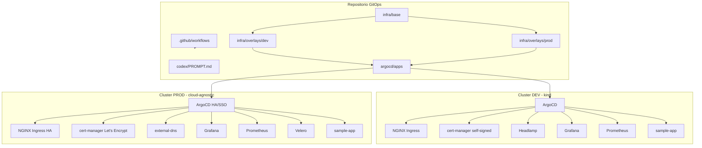
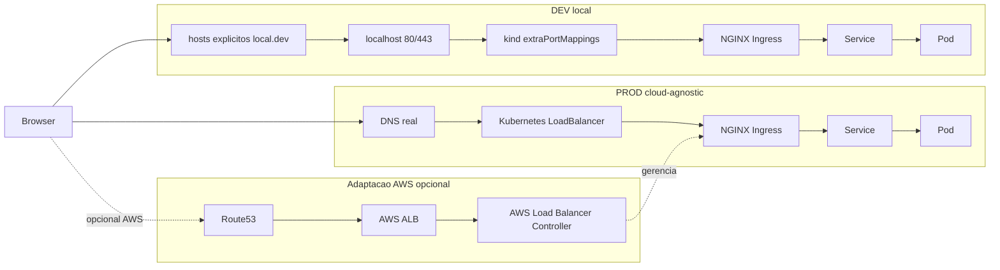
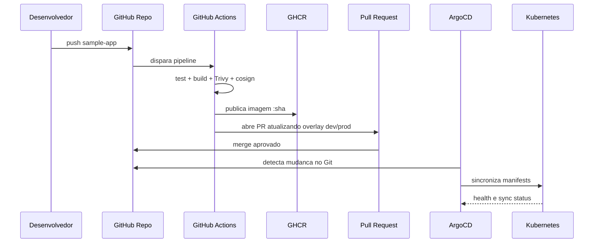
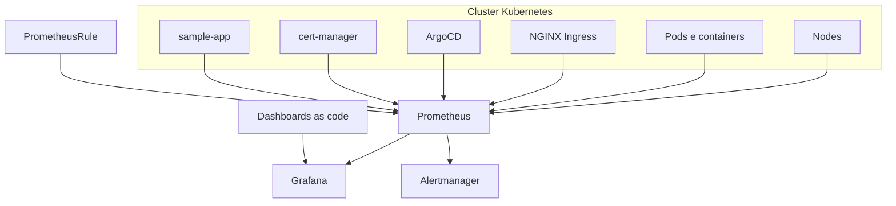

# Arquitetura - Plataforma GitOps Kubernetes Codex

## Visao Geral

Esta arquitetura descreve uma plataforma GitOps em camadas.

A diferenca principal desta versao Codex e a ordem de entrega: primeiro um MVP pequeno,
funcional e validavel; depois as capacidades avancadas.

O objetivo e evitar uma implementacao grande demais antes de provar o fluxo principal:

```text
Git -> ArgoCD -> Kubernetes -> Ingress -> Aplicacao -> Monitoramento
```

## Diagramas de Arquitetura

### Visao de Componentes



### Acesso Web e Entrada de Trafego



### Fluxo GitOps e Promocao



### Observabilidade



## Camadas

### 1. Cluster

No ambiente dev, o cluster roda com `kind`.

Composicao:

- 1 control-plane.
- 2 workers.
- portas 80 e 443 mapeadas para o host.
- CNI padrao do kind no MVP.

Em producao, o repositorio nao cria o cluster. Ele apenas documenta os requisitos minimos:

- Kubernetes >= 1.28.
- StorageClass dinamica.
- mecanismo de LoadBalancer.
- acesso a internet para imagens, Let's Encrypt e repositorios.
- permissao para instalar CRDs.

### 2. GitOps

ArgoCD e o reconciliador principal.

Existe uma fase inicial de bootstrap, na qual o script instala o ArgoCD. Depois disso,
o ArgoCD assume o controle dos demais componentes.

Padrao:

- `argocd/apps/app-of-apps-dev.yaml` como raiz dev.
- `argocd/apps/app-of-apps-prod.yaml` como raiz prod.
- `ApplicationSet` para evolucao multiambiente.

### 3. Manifests

Os manifests seguem o modelo:

```text
infra/base
infra/overlays/dev
infra/overlays/prod
```

A base contem o que e comum.
O overlay contem apenas o que muda por ambiente.

Exemplos de diferencas:

| Item | Dev | Prod |
|---|---|---|
| Dominio | `*.local.dev` com hosts explicitos | dominio real |
| TLS | self-signed | Let's Encrypt |
| Replicas | 1 | 2 ou mais |
| Storage | local/pequeno | persistente |
| PSS | baseline | restricted |
| ArgoCD | simples | HA/SSO |
| Alertas | local | rotas reais |

### 4. Entrada Web

No dev:

```text
Browser
  -> hosts locais
  -> localhost:80/443
  -> kind extraPortMappings
  -> NGINX Ingress Controller
  -> Service
  -> Pod
```

Em producao cloud-agnostic:

```text
Browser
  -> DNS real
  -> LoadBalancer Kubernetes
  -> NGINX Ingress Controller
  -> Service
  -> Pod
```

Em AWS, isso pode ser adaptado para ALB usando AWS Load Balancer Controller, mas essa
adaptacao fica documentada fora do caminho padrao para manter o projeto portavel.

## Paineis Web

### ArgoCD

URL dev:

```text
https://argocd.local.dev
```

Funcao:

- GitOps;
- sync;
- diff Git vs cluster;
- historico de deploy;
- status de aplicacoes;
- arvore de recursos Kubernetes.

ArgoCD mostra pods e imagens, mas nao e um gerenciador de containers como Portainer.
Ele ve containers pela lente de `Deployment`, `ReplicaSet` e `Pod`.

### Headlamp

URL dev:

```text
https://headlamp.local.dev
```

Funcao:

- gestao visual do cluster;
- namespaces;
- pods;
- services;
- ingress;
- logs;
- events;
- troubleshooting operacional.

### Grafana

URL dev:

```text
https://grafana.local.dev
```

Funcao:

- dashboards;
- CPU/memoria por node e pod;
- reinicios;
- disponibilidade;
- metricas de ingress;
- metricas de ArgoCD;
- status de certificados.

### Prometheus

URL dev:

```text
https://prometheus.local.dev
```

Funcao:

- PromQL;
- targets;
- rules;
- metricas brutas.

### Alertmanager

URL dev:

```text
https://alertmanager.local.dev
```

Funcao:

- alertas ativos;
- silenciamentos;
- rotas de notificacao.

## Seguranca

Seguranca entra em duas etapas.

No MVP:

- acesso local;
- TLS self-signed;
- credenciais iniciais documentadas;
- sem segredo puro em manifests.

Na fase de hardening:

- Sealed Secrets;
- NetworkPolicy default-deny;
- Pod Security Standards;
- RBAC minimo;
- assinatura de imagem;
- scan de vulnerabilidades;
- validacao futura com policy engine.

## Observabilidade

O monitoramento usa `kube-prometheus-stack`.

Componentes:

- Prometheus;
- Grafana;
- Alertmanager;
- node-exporter;
- kube-state-metrics;
- ServiceMonitors.

Dashboards e alertas devem ser versionados no repositorio.

## CI/CD

O CI nao aplica no cluster.

Fluxo esperado:

```text
push
  -> GitHub Actions
  -> testes
  -> build
  -> Trivy scan
  -> cosign sign
  -> push GHCR
  -> PR alterando tag no overlay
  -> merge
  -> ArgoCD sync
```

## Producao

O overlay prod deve ser renderizavel mesmo sem cluster de producao disponivel.

Ele deve preparar:

- TLS Let's Encrypt;
- replicas maiores;
- storage persistente;
- PSS restricted;
- configuracao para DNS real;
- Velero;
- ArgoCD com caminho para SSO/HA.

## Decisoes Codex

1. MVP antes de plataforma completa.
2. Sealed Secrets como primeira solucao de segredos.
3. `.github/workflows` na raiz, nao dentro de pasta auxiliar.
4. Hosts explicitos no dev, porque `/etc/hosts` nao suporta wildcard.
5. Prod cloud-agnostic como padrao.
6. AWS ALB como adaptacao documentada, nao como dependencia inicial.
